# Специфікація AWPS

## 1. Призначення системи

AWPS (Automated Watering Plant System) — система автоматизованого моніторингу стану рослин та керування їх поливом.

Система повинна аналізувати параметри середовища рослини та автоматично виконувати полив за визначеними користувачем алгоритмами. Система також повинна забезпечувати збереження історії вимірювань, налаштування IoT-пристроїв та перегляд стану рослин користувачем.

---

# 2. Функціональні вимоги

## FR-01. Моніторинг параметрів середовища

### FR-01.1. Збір даних
Система повинна збирати дані з датчиків про освітленість, вологість ґрунту, вологість повітря та температуру повітря.

### FR-01.2. Періодичність вимірювань
Система повинна періодично виконувати вимірювання параметрів середовища. Інтервал між вимірюваннями повинен налаштовуватися користувачем. Значення інтервалу за замовчуванням — 1 година.

### FR-01.3. Локальне зберігання
Система повинна зберігати результати вимірювань локально на IoT-пристрої.

### FR-01.4. Обробка помилок вимірювання
У разі виникнення помилки під час отримання даних із датчика система повинна повторити операцію не більше 5 разів. Якщо після 5 спроб отримати дані не вдалося, система повинна повідомити користувача про проблему.

---

## FR-02. Синхронізація даних із сервером

### FR-02.1. Встановлення з'єднання
Система повинна встановлювати та підтримувати з'єднання із сервером паралельно з процесом вимірювання параметрів середовища.

### FR-02.2. Початок передачі
Система повинна розпочинати передачу даних на сервер тільки після завершення відповідного вимірювання.

### FR-02.3. Передача даних
Після завершення вимірювання система повинна передати отримані та локально збережені дані на сервер, якщо з'єднання із сервером доступне.

### FR-02.4. Підтвердження збереження
Після передачі даних система повинна очікувати підтвердження від сервера про їх успішне збереження.

### FR-02.5. Успішна синхронізація
У разі отримання підтвердження про успішне збереження даних система повинна видалити відповідні дані з локального сховища.

### FR-02.6. Помилка синхронізації
У разі помилки передачі або відсутності підтвердження від сервера система не повинна видаляти локально збережені дані.

---

## FR-03. Автоматичний полив

### FR-03.1. Визначення потреби в поливі
Система повинна використовувати вибраний користувачем алгоритм визначення потреби в поливі із заданими користувачем параметрами.

### FR-03.2. Активація поливу
Якщо алгоритм визначив необхідність поливу, система повинна активувати полив на задану користувачем тривалість. Значення тривалості поливу за замовчуванням — 5 секунд.

### FR-03.3. Період між циклами поливу
Після завершення циклу поливу система повинна очікувати заданий користувачем період перед виконанням наступного вимірювання та оцінкою потреби в подальшому поливі. Значення періоду за замовчуванням — 5 хвилин.

### FR-03.4. Повторне вимірювання
Після завершення періоду очікування система повинна виконати вимірювання параметрів середовища та використовувати отримані дані для визначення необхідності подальшого поливу.

### FR-03.5. Визначення завершення поливу
Для визначення необхідності продовження поливу система повинна використовувати вибраний користувачем алгоритм із заданими користувачем параметрами.

### FR-03.6. Продовження поливу
Якщо алгоритм визначення продовження поливу визначив, що полив необхідний, система повинна виконати наступний цикл поливу.

### FR-03.7. Завершення поливу
Система повинна завершити процес автоматичного поливу, якщо алгоритм визначив, що подальший полив не потрібний.

### FR-03.8. Повідомлення про полив
Система повинна повідомляти користувача про початок та завершення автоматичного поливу.

### FR-03.9. Налаштування алгоритмів
Система повинна дозволяти користувачу вибирати алгоритми визначення потреби в поливі та визначення завершення поливу, а також налаштовувати параметри кожного алгоритму.

### FR-03.10. Виконання поливу
Автоматичний полив повинен виконуватися безпосередньо IoT-пристроєм.

---

## FR-04. Перегляд виміряних даних

### FR-04.1. Графічний інтерфейс
Система повинна надавати користувачу графічний інтерфейс для перегляду виміряних даних.

### FR-04.2. Графіки параметрів
Система повинна відображати виміряні значення кожного параметра у вигляді графіка залежності значення параметра від часу.

### FR-04.3. Перемикання між параметрами
Система повинна дозволяти користувачу перемикатися між графіками різних параметрів.

### FR-04.4. Масштабування
Система повинна дозволяти користувачу змінювати масштаб відображення графіків для детальнішого перегляду даних.

### FR-04.5. Перегляд конкретного вимірювання
Система повинна дозволяти користувачу переглядати конкретне виміряне значення та час його отримання.

### FR-04.6. Часовий проміжок
Система повинна дозволяти користувачу задавати часовий проміжок, за який необхідно відображати виміряні дані.

---

## FR-05. Налаштування IoT-пристрою

### FR-05.1. Інтервал вимірювань
Система повинна дозволяти користувачу налаштовувати інтервал між вимірюваннями параметрів середовища.

### FR-05.2. Алгоритм початку поливу
Система повинна дозволяти користувачу вибирати алгоритм визначення потреби в поливі та налаштовувати його параметри.

### FR-05.3. Алгоритм завершення поливу
Система повинна дозволяти користувачу вибирати алгоритм визначення необхідності продовження поливу та налаштовувати його параметри.

### FR-05.4. Тривалість поливу
Система повинна дозволяти користувачу налаштовувати тривалість одного циклу поливу.

### FR-05.5. Період між циклами
Система повинна дозволяти користувачу налаштовувати період між циклами поливу та повторним вимірюванням параметрів середовища.

---

## FR-06. Профілі рослин

### FR-06.1. Створення профілю
Система повинна дозволяти користувачу створювати профіль рослини із зазначенням її імені та прив'язаного IoT-пристрою.

### FR-06.2. Перегляд профілю
Система повинна дозволяти користувачу переглядати створені профілі рослин, включно з іменем рослини, прив'язаним пристроєм, виміряними даними та налаштуваннями.

### FR-06.3. Редагування профілю
Система повинна дозволяти користувачу редагувати дані профілю рослини та його налаштування.

### FR-06.4. Видалення профілю
Система повинна дозволяти користувачу видаляти профіль рослини.

### FR-06.5. Кілька профілів
Система повинна дозволяти користувачу створювати та зберігати декілька профілів рослин, при цьому кожен профіль повинен відповідати одній рослині.

---

## FR-07. Push-повідомлення

### FR-07.1. Надсилання повідомлень
Система повинна надсилати користувачу push-повідомлення про події та проблеми, пов'язані з роботою системи.

### FR-07.2. Повідомлення від IoT-пристрою
Система повинна надсилати користувачу push-повідомлення про події та проблеми, інформація про які надійшла від IoT-пристрою.

### FR-07.3. Повідомлення від сервера
Система повинна надсилати користувачу push-повідомлення про події та проблеми, виявлені сервером.

---

# 3. Нефункціональні вимоги

## NFR-01. Надійність

### NFR-01.1. Незалежність від сервера
Відсутність або втрата з'єднання із сервером не повинна перешкоджати виконанню вимірювань та локальному зберіганню отриманих даних на IoT-пристрої.

### NFR-01.2. Вимірювання після перезапуску
Після кожного перезапуску IoT-пристрій повинен виконати вимірювання параметрів середовища.

### NFR-01.3. Збереження несинхронізованих даних
Дані, отримані під час відсутності з'єднання із сервером, повинні зберігатися локально до моменту успішної синхронізації із сервером.

### NFR-01.4. Переповнення локального сховища
У разі переповнення локального сховища система повинна зменшити обсяг даних шляхом об'єднання декількох записів вимірювань в один запис із збереженням інформації про результати вимірювань.

---

## NFR-02. Часові характеристики

### NFR-02.1. Застосування налаштувань
Нові або змінені налаштування повинні застосовуватися IoT-пристроєм після їх отримання.

### NFR-02.2. Повідомлення від сервера
Повідомлення про події та проблеми, джерелом яких є сервер, повинні надсилатися користувачу одразу після виникнення відповідної події або виявлення проблеми.

### NFR-02.3. Повідомлення від IoT
Повідомлення про події та проблеми, джерелом яких є IoT-пристрій, повинні доставлятися користувачу після синхронізації пристрою із сервером.

---

## NFR-03. Масштабованість

### NFR-03.1. Кількість профілів
Система не повинна встановлювати фіксованого обмеження на кількість профілів рослин, які може створити користувач.

### NFR-03.2. Кілька IoT-пристроїв
Система повинна підтримувати роботу користувача з декількома IoT-пристроями.

### NFR-03.3. Історія вимірювань
Система повинна забезпечувати можливість зберігання повної історії вимірювань без встановлення обмеження за кількістю записів.

---

## NFR-04. Безпека

### NFR-04.1. Ізоляція даних
Система повинна забезпечувати доступ користувача лише до профілів рослин, IoT-пристроїв, налаштувань та виміряних даних, що належать його серверу.

### NFR-04.2. Захищена передача
Дані під час передачі між IoT-пристроєм, сервером та клієнтською частиною системи повинні передаватися захищеним каналом.

### NFR-04.3. Керування налаштуваннями
Система повинна забезпечувати можливість зміни налаштувань IoT-пристрою лише через передбачений системою механізм керування відповідним пристроєм.

### NFR-04.4. Видалення пов'язаних даних
У разі видалення профілю рослини система повинна видаляти пов'язані з ним виміряні дані.

### NFR-04.5. Ідентифікація IoT-пристрою
Система повинна забезпечувати ідентифікацію IoT-пристрою та перевірку його належності до відповідного сервера під час взаємодії з сервером.

---

## NFR-05. Зручність використання

### NFR-05.1. Інтуїтивність
Інтерфейс системи повинен бути інтуїтивно зрозумілим та придатним для використання користувачем без спеціальних технічних знань.

### NFR-05.2. Додаткові пояснення
Для функцій та параметрів, значення або призначення яких може бути незрозумілим користувачу, система повинна надавати додаткові пояснення або опис.

### NFR-05.3. Перевірка налаштувань
Система повинна перевіряти коректність значень, введених користувачем під час налаштування системи. Допустимі значення повинні визначатися окремо для кожного параметра.

### NFR-05.4. Повідомлення про помилки
У разі виникнення відомої помилки система повинна надавати користувачу зрозуміле повідомлення про причину проблеми та, за можливості, рекомендацію щодо її усунення.

### NFR-05.5. Стан пристрою
Система повинна надавати користувачу інформацію про поточний стан IoT-пристрою та стан його синхронізації із сервером.

### NFR-05.6. Час останніх операцій
Система повинна відображати час останнього вимірювання та час останньої синхронізації IoT-пристрою із сервером.

### NFR-05.7. Читабельність графіків
Графічне представлення виміряних даних повинно забезпечувати користувачу зрозуміле сприйняття залежності значень параметрів від часу.

---

## NFR-06. Сумісність та середовище виконання

### NFR-06.1. Тип IoT-пристрою
Система повинна підтримувати роботу з визначеним для проєкту типом IoT-пристрою.

### NFR-06.2. Набір датчиків
IoT-пристрій повинен працювати з визначеним набором датчиків, передбаченим поточною версією системи.

### NFR-06.3. Клієнтські платформи
Клієнтська частина системи повинна підтримувати роботу на платформах Windows та Android.

### NFR-06.4. Локальне виконання сервера
Серверна частина системи повинна мати можливість працювати безпосередньо на пристрої користувача.

### NFR-06.5. Мережеве підключення IoT
IoT-пристрій повинен забезпечувати підключення до системи через мережу Wi-Fi.

---

## NFR-07. Супроводжуваність та розширюваність

### NFR-07.1. Заміна датчика
Система повинна підтримувати заміну датчика на інший датчик того самого типу без зміни функціональності системи.

### NFR-07.2. Додавання алгоритмів
Система повинна передбачати можливість додавання розробником нових алгоритмів визначення потреби в поливі та завершення поливу без необхідності зміни вже реалізованих алгоритмів.

### NFR-07.3. Незалежність алгоритмів
Додавання або зміна одного алгоритму поливу не повинна вимагати зміни інших реалізованих алгоритмів.

---

## NFR-08. Збереження даних

### NFR-08.1. Термін зберігання
Система повинна зберігати всі отримані результати вимірювань без обмеження терміну їх зберігання, доки відповідний профіль рослини не буде видалено користувачем.

### NFR-08.2. Незмінність вимірювань
Після збереження результат вимірювання не повинен змінюватися системою.

### NFR-08.3. Час вимірювання
Кожен результат вимірювання повинен містити час його отримання, визначений за системним часом IoT-пристрою.

### NFR-08.4. Синхронізація часу
Системний час IoT-пристрою повинен бути синхронізований для забезпечення коректного визначення часу отримання результатів вимірювань.

# 4. Архітектура системи

## 4.1. Загальна архітектура

Система AWPS складається з трьох основних компонентів:

1. **IoT-пристрій** — відповідає за взаємодію з датчиками та насосом, локальне зберігання вимірювань, виконання алгоритмів автоматичного поливу та синхронізацію даних із сервером.
2. **Серверна частина** — відповідає за централізоване зберігання профілів рослин, вимірювань та налаштувань, а також за взаємодію між клієнтською частиною та IoT-пристроями.
3. **Клієнтська частина** — забезпечує взаємодію користувача із системою, перегляд даних, керування профілями та налаштуваннями.

Один сервер призначений для одного користувача та може обслуговувати декілька IoT-пристроїв.

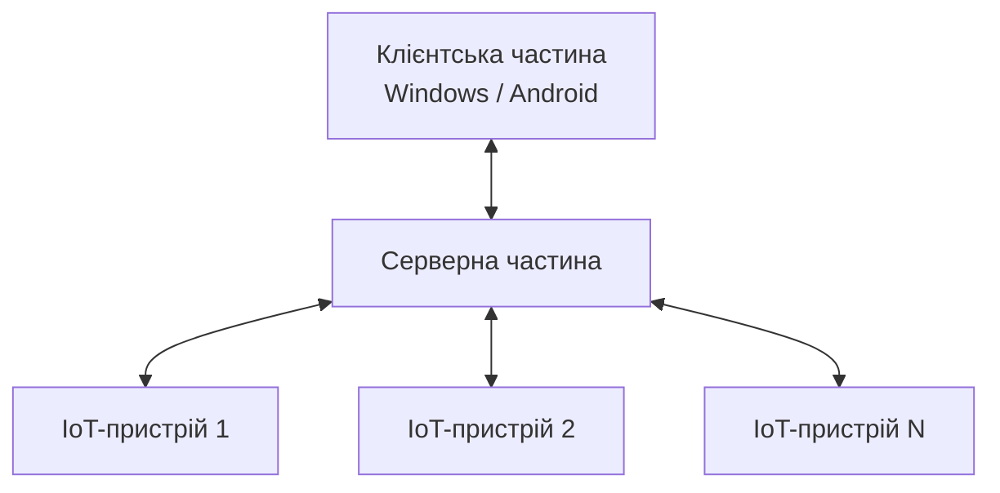

Основний обмін даними між компонентами системи виконується через сервер. Пряме з'єднання клієнтської частини з IoT-пристроєм використовується під час початкового налаштування пристрою.

---

## 4.2. IoT-пристрій

IoT-пристрій є автономним компонентом системи, який безпосередньо взаємодіє з фізичним середовищем рослини.

IoT-пристрій відповідає за:

- отримання даних із датчиків;
- формування результатів вимірювань;
- локальне зберігання результатів вимірювань;
- виконання алгоритму визначення потреби в поливі;
- виконання алгоритму визначення необхідності продовження поливу;
- керування насосом;
- синхронізацію вимірювань із сервером;
- отримання та застосування налаштувань;
- передачу серверу інформації про локальні події та проблеми;
- підтримання синхронізованого системного часу.

Виконання автоматичного поливу не залежить від доступності сервера. Рішення про початок, продовження або завершення поливу приймається безпосередньо IoT-пристроєм.

### 4.2.1. Логічна структура IoT-пристрою

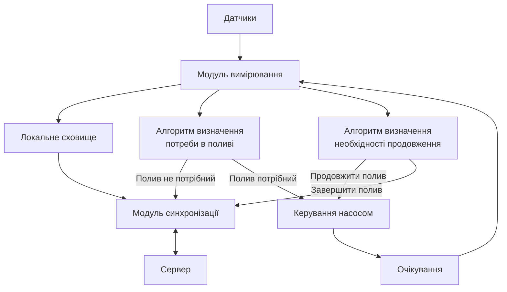

Алгоритми визначення початку та завершення поливу є окремими логічними компонентами. Це дозволяє використовувати різні алгоритми для визначення потреби в поливі та для визначення моменту завершення поливу.

---

## 4.3. Автономний цикл роботи IoT-пристрою

IoT-пристрій повинен виконувати основний цикл роботи незалежно від стану з'єднання із сервером.

Загальна логіка роботи:

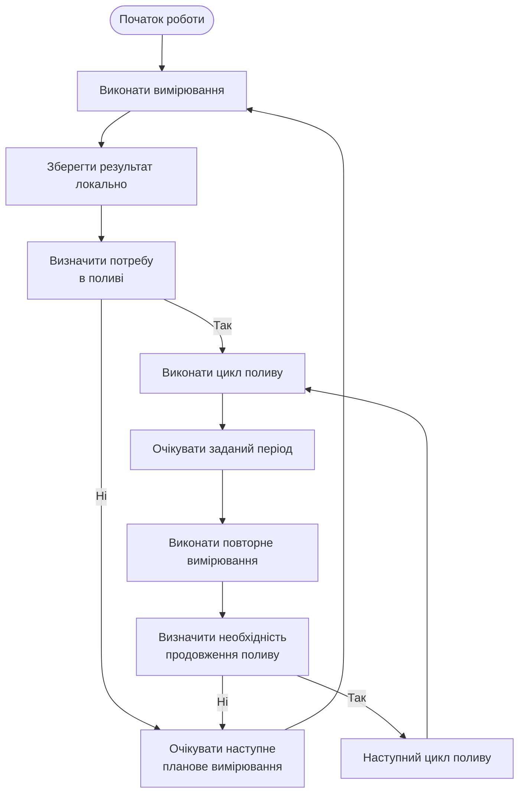

З'єднання із сервером та синхронізація накопичених даних можуть виконуватися паралельно з основним циклом роботи IoT-пристрою.

---

## 4.4. Серверна частина

Сервер є центральним компонентом системи для довготривалого зберігання даних та координації взаємодії між клієнтською частиною та IoT-пристроями.

Сервер відповідає за:

- зберігання профілів рослин;
- зберігання історії вимірювань;
- зберігання налаштувань IoT-пристроїв;
- реєстрацію та ідентифікацію IoT-пристроїв;
- прив'язку IoT-пристроїв до профілів рослин;
- приймання вимірювань від IoT-пристроїв;
- підтвердження успішного збереження вимірювань;
- передачу налаштувань IoT-пристроям;
- обробку подій та проблем;
- взаємодію з клієнтською частиною.

Сервер не виконує алгоритми автоматичного поливу та не керує насосом безпосередньо.

### 4.4.1. Логічна структура сервера

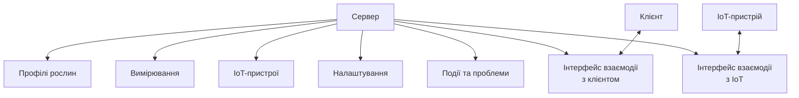

---

## 4.5. Клієнтська частина

Клієнтська частина забезпечує взаємодію користувача із системою.

Клієнт відповідає за:

- створення профілів рослин;
- перегляд профілів;
- редагування профілів;
- видалення профілів;
- прив'язку IoT-пристроїв;
- перегляд виміряних даних;
- відображення графіків;
- налаштування IoT-пристроїв;
- перегляд поточного стану пристроїв;
- перегляд стану синхронізації;
- відображення повідомлень про події та проблеми.

Клієнтська частина повинна підтримувати роботу на платформах Windows та Android.

У штатному режимі клієнтська частина взаємодіє із сервером.

---

## 4.6. Початкове налаштування IoT-пристрою

Під час початкового налаштування клієнтська частина може встановлювати пряме з'єднання з IoT-пристроєм.

Таке з'єднання використовується для виконання операцій, необхідних для підключення нового пристрою до системи.

Зокрема, під час початкового налаштування IoT-пристрій повинен отримати інформацію, необхідну для подальшої взаємодії із сервером.

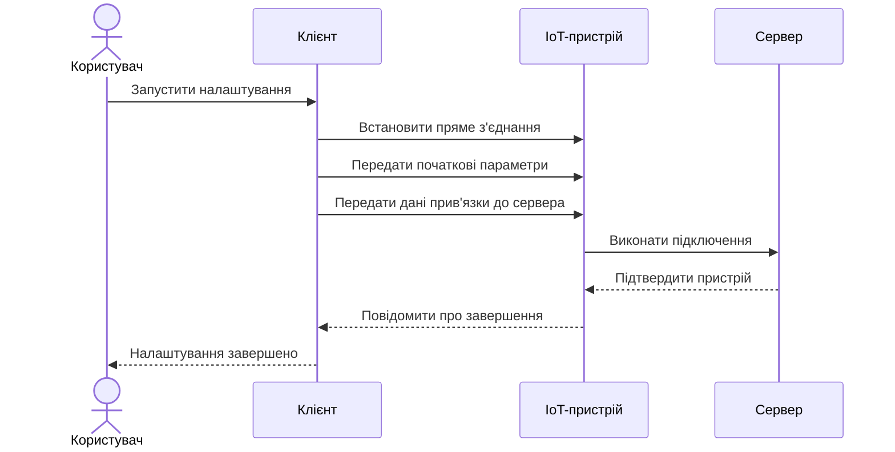

Після завершення початкового налаштування основна взаємодія IoT-пристрою із системою виконується через сервер.

---

## 4.7. Ідентифікація та прив'язка IoT-пристрою

Кожен IoT-пристрій повинен мати унікальний ідентифікатор.

Для забезпечення належності пристрою до конкретного сервера система повинна використовувати механізм ідентифікації та авторизації.

Концептуально IoT-пристрій повинен мати:

- ідентифікатор пристрою;
- ідентифікатор сервера;
- дані, необхідні для підтвердження права взаємодії з сервером.

Під час взаємодії сервер перевіряє отриману ідентифікаційну інформацію.

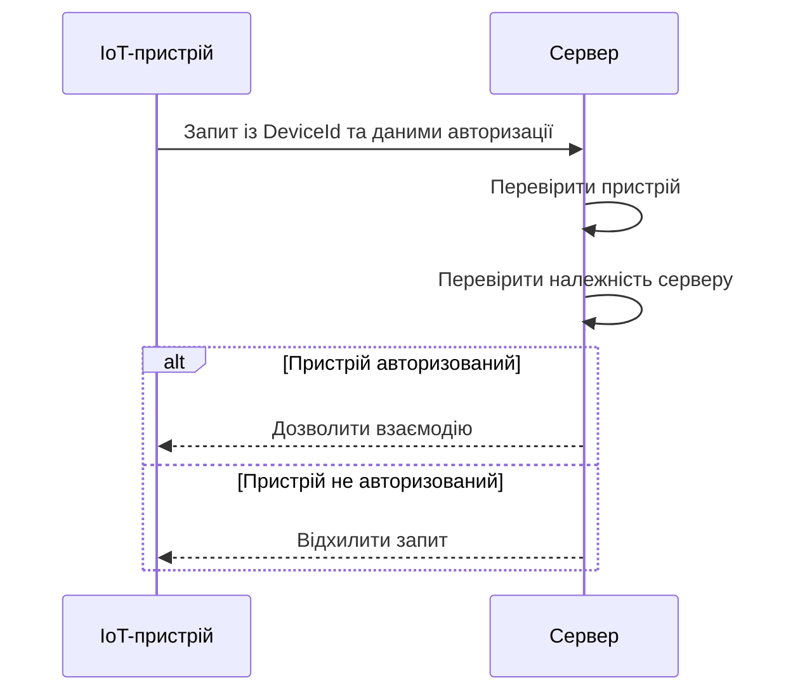

IoT-пристрій, який не належить відповідному серверу, не повинен мати доступу до даних цього сервера.

---

## 4.8. Синхронізація вимірювань

Локальне сховище IoT-пристрою використовується як тимчасове сховище вимірювань до моменту їх успішного збереження на сервері.

Передача даних виконується за принципом підтвердження збереження.

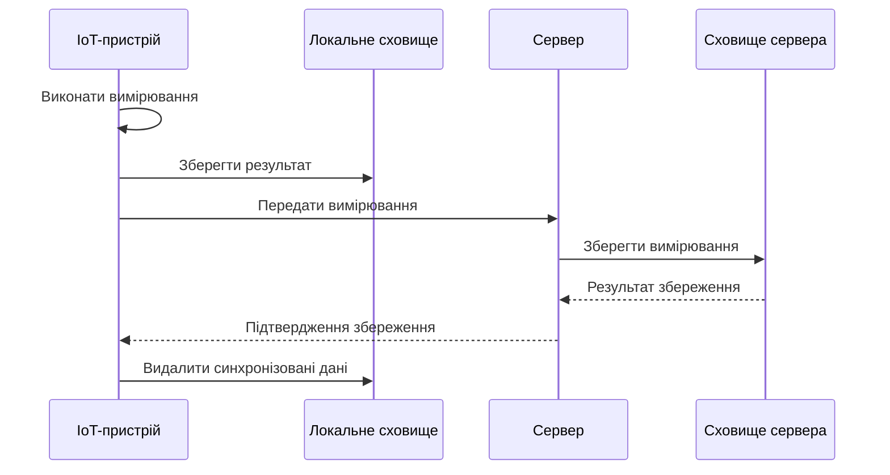

Якщо передача завершилася помилкою або сервер не підтвердив успішне збереження, відповідні дані залишаються в локальному сховищі IoT-пристрою.

Таким чином, тимчасове локальне сховище забезпечує збереження вимірювань під час недоступності сервера або мережевого з'єднання.

---

## 4.9. Передача налаштувань

Налаштування IoT-пристрою можуть змінюватися користувачем через клієнтську частину.

Послідовність зміни налаштувань:

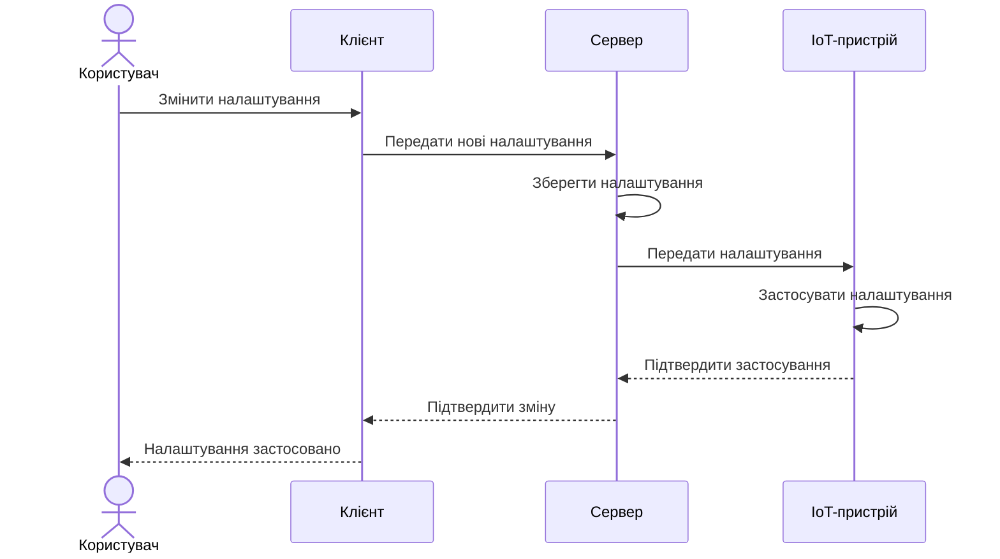

Сервер зберігає актуальну конфігурацію та передає її відповідному IoT-пристрою.

IoT-пристрій застосовує отримані налаштування та використовує їх під час подальшої роботи.

---

## 4.10. Обробка подій та повідомлень

Події та проблеми можуть виникати на IoT-пристрої або на сервері.

### 4.10.1. Події IoT-пристрою

Інформація про подію або проблему передається на сервер під час синхронізації.

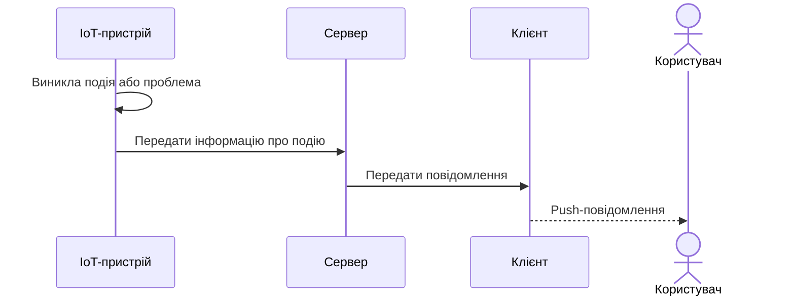

### 4.10.2. Події сервера

Події, джерелом яких є сервер, обробляються безпосередньо сервером та передаються користувачу.

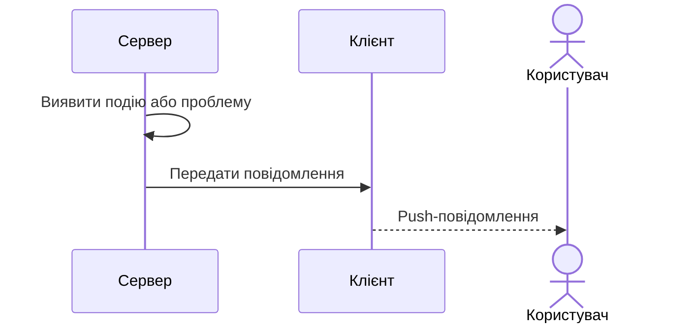

---

## 4.11. Взаємодія компонентів

Основні напрямки обміну даними між компонентами системи:

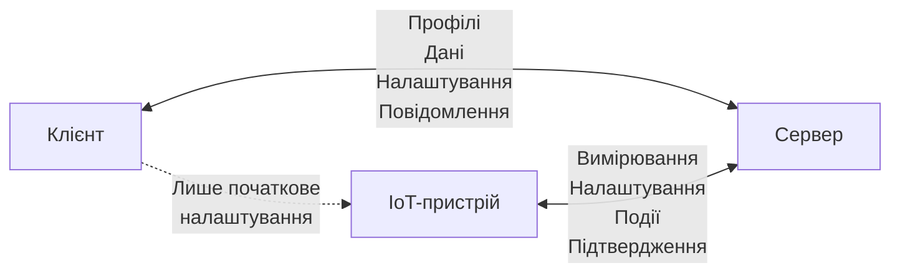

Прямий зв'язок між клієнтом та IoT-пристроєм не є основним каналом роботи системи та використовується для початкового налаштування пристрою.

---

## 4.12. Основні принципи архітектури

Архітектура AWPS повинна дотримуватися таких принципів:

1. **Автономність IoT-пристрою.** Вимірювання та автоматичний полив не повинні залежати від доступності сервера.

2. **Розподіл відповідальності.** IoT-пристрій відповідає за фізичний процес, сервер — за зберігання та координацію, клієнт — за взаємодію з користувачем.

3. **Централізоване довготривале зберігання.** Сервер є основним сховищем профілів та історії вимірювань.

4. **Тимчасове локальне зберігання.** IoT-пристрій зберігає вимірювання локально до моменту підтвердження їх успішного збереження сервером.

5. **Надійна синхронізація.** Локальні дані не видаляються до отримання підтвердження від сервера.

6. **Ізоляція пристроїв.** IoT-пристрій повинен мати доступ лише до сервера, з яким він пов'язаний.

7. **Незалежність алгоритмів поливу.** Алгоритми визначення початку та завершення поливу виконуються на IoT-пристрої та не залежать від серверної частини.

8. **Один сервер — один користувач.** Сервер обслуговує дані та IoT-пристрої одного користувача.

9. **Початкове пряме підключення.** Прямий зв'язок клієнта з IoT-пристроєм використовується для початкового налаштування та прив'язки пристрою до сервера.

10. **Захищена взаємодія.** Обмін даними між компонентами системи повинен виконуватися із використанням механізмів, що забезпечують конфіденційність та перевірку сторін взаємодії.

# 5. Взаємодія компонентів системи

## 5.1. Загальні положення

Обмін даними в AWPS виконується між клієнтською частиною, серверною частиною та IoT-пристроями.

Основними типами даних, що передаються між компонентами системи, є:

- виміряні дані;
- налаштування IoT-пристроїв;
- події та проблеми;
- повідомлення-підтвердження.

Для взаємодії між компонентами використовуються такі протоколи:

- між IoT-пристроєм та сервером — MQTT;
- між сервером та клієнтською частиною — HTTP;
- між клієнтською частиною та IoT-пристроєм під час початкового налаштування — HTTP.

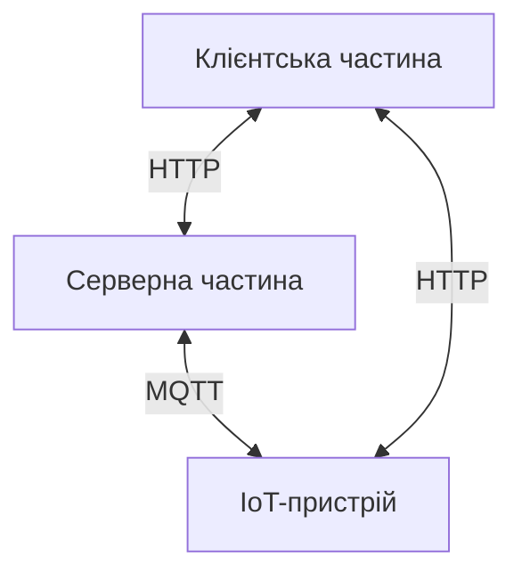

Детальні правила взаємодії між компонентами визначаються в наступних підрозділах.

---

## 5.2. Взаємодія IoT-пристрою із сервером

Взаємодія IoT-пристрою із сервером повинна включати:

1. встановлення з'єднання та ідентифікацію пристрою;
2. передачу виміряних даних;
3. підтвердження успішного збереження виміряних даних;
4. передачу подій та проблем;
5. підтвердження успішного збереження подій та проблем;
6. отримання налаштувань;
7. підтвердження застосування налаштувань.

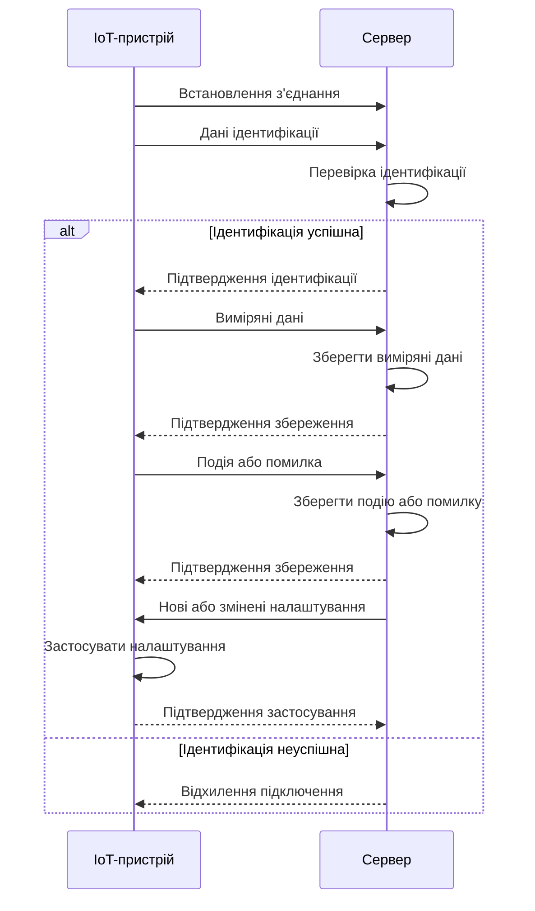

---

## 5.3. Синхронізація вимірювань

IoT-пристрій повинен локально зберігати кожен результат вимірювання до моменту його успішного збереження на сервері.

Якщо з'єднання із сервером доступне, IoT-пристрій повинен передавати локально збережені вимірювання на сервер.

Для кожного вимірювання повинні передаватися час його отримання та відповідні значення параметрів.

Після отримання даних сервер повинен зберегти їх та передати IoT-пристрою підтвердження успішного збереження.

IoT-пристрій повинен видалити відповідні локальні дані лише після отримання такого підтвердження.

У разі помилки передачі, помилки збереження або відсутності підтвердження локальні дані повинні залишатися у сховищі IoT-пристрою.

Несинхронізовані дані можуть бути передані під час наступного циклу синхронізації, коли з'єднання із сервером буде доступним.

Окремий механізм повторної відправки одного повідомлення не передбачається.

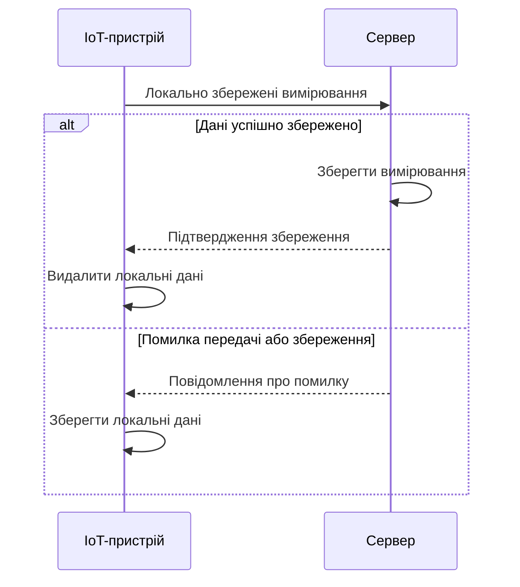

---

## 5.4. Передача налаштувань

Зміна налаштувань IoT-пристрою виконується за схемою:

**користувач → клієнт → сервер → IoT-пристрій.**

Клієнтська частина передає змінені налаштування серверу. Сервер зберігає їх та передає відповідному IoT-пристрою.

IoT-пристрій після отримання налаштувань повинен застосувати їх та передати серверу підтвердження застосування.

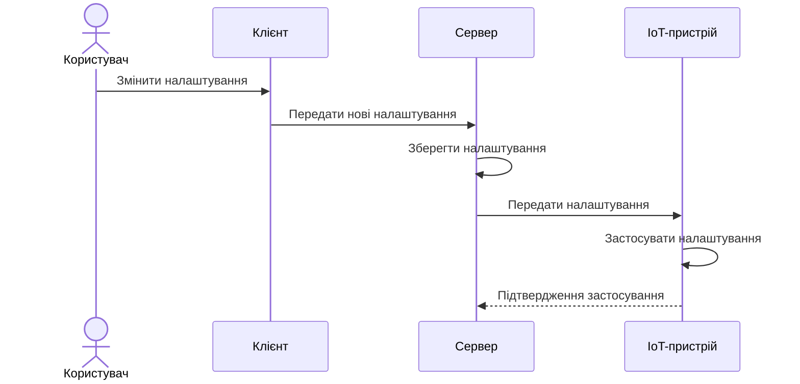

---

## 5.5. Початкове підключення IoT-пристрою

Для початкового налаштування IoT-пристрій повинен створити власну Wi-Fi мережу, до якої підключається клієнтська частина.

Користувач повинен надати клієнтській частині облікові дані Wi-Fi мережі, до якої в подальшому повинен підключатися IoT-пристрій.

Клієнтська частина повинна передати IoT-пристрою:

- облікові дані Wi-Fi мережі;
- ідентифікатор сервера (`ServerId`);
- ідентифікатор IoT-пристрою (`DeviceId`);
- за необхідності — дані, необхідні для автентифікації на сервері.

Після збереження отриманих параметрів IoT-пристрій повинен підключитися до Wi-Fi мережі та встановити з'єднання із сервером.

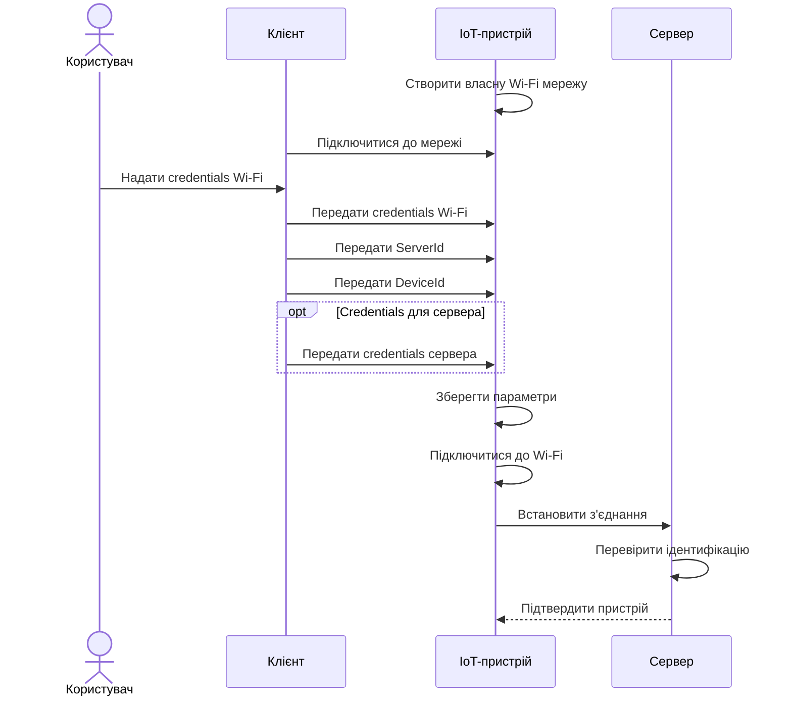

---

## 5.6. Передача подій та проблем

Події та проблеми можуть виникати на IoT-пристрої або на сервері.

Повідомлення про подію або проблему повинно містити:

- дату та час події;
- тип події;
- повідомлення.

Тип події повинен мати одне з таких значень:

- `Info`;
- `Warning`;
- `Error`.

Концептуально повідомлення має структуру:

```text
[Дата події, Тип події, Повідомлення]
```

Події та проблеми, що виникають на IoT-пристрої, повинні передаватися на сервер за тим самим принципом, що й виміряні дані.

Події та проблеми, що виникають на сервері, обробляються безпосередньо сервером.

Після отримання або виявлення події сервер повинен передати інформацію клієнтській частині для формування push-повідомлення користувачу.

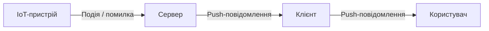

---

## 5.7. Формат повідомлень

Повідомлення між IoT-пристроєм та сервером повинні передаватися у бінарному форматі.

Для кожного типу повідомлення повинна використовуватися окрема структура даних, визначена специфікацією відповідного повідомлення.

Ідентифікатор сервера (`ServerId`) та ідентифікатор IoT-пристрою (`DeviceId`) повинні передаватися в MQTT topic, а не в тілі бінарного повідомлення.

Для кожного типу запиту повинна використовуватися окрема тема для запиту та окрема тема для відповіді.

Структура MQTT topic повинна мати вигляд:

```text
awps/{ServerId}/{DeviceId}/{MessageType}/{MessageDirection}
```

де:

- `ServerId` — ідентифікатор сервера;
- `DeviceId` — ідентифікатор IoT-пристрою;
- `MessageType` — тип повідомлення;
- `MessageDirection` — напрямок повідомлення: `request` або `response`.

Приклади:

```text
awps/{ServerId}/{DeviceId}/measurements/request
awps/{ServerId}/{DeviceId}/measurements/response

awps/{ServerId}/{DeviceId}/events/request
awps/{ServerId}/{DeviceId}/events/response

awps/{ServerId}/{DeviceId}/settings/request
awps/{ServerId}/{DeviceId}/settings/response
```

Напрямок `request` або `response` визначає взаємозв'язок повідомлень, а не сторону, яка ініціює взаємодію.

---

## 5.8. MQTT

Для обміну даними між IoT-пристроєм та сервером повинен використовуватися протокол MQTT.

IoT-пристрій та сервер повинні використовувати модель обміну повідомленнями через MQTT topics відповідно до структури, визначеної в підрозділі 5.7.

Для основних повідомлень, що містять виміряні дані, події або іншу інформацію, повинен використовуватися **QoS 0**.

Для повідомлень-відповідей, що містять підтвердження отримання, збереження або застосування даних, повинен використовуватися **QoS 1**.

Основні повідомлення передаються без гарантованої доставки на рівні MQTT. Надійність збереження вимірювань забезпечується локальним сховищем IoT-пристрою та підтвердженням успішного збереження сервером.

Повідомлення-відповіді передаються з гарантованою щонайменше одноразовою доставкою на рівні MQTT. Сторони системи повинні коректно обробляти можливу повторну доставку таких повідомлень.

## 6. Структура даних

### 6.1 Загальні положення

Система використовує набір структур даних для представлення профілів рослин, IoT-пристроїв, вимірювань, налаштувань та подій.

Основною сутністю системи є `PlantProfile`. Налаштування, вимірювання та події пов'язані з відповідним профілем рослини.

### 6.2 PlantProfile

`PlantProfile` описує рослину та IoT-пристрій, який використовується для її обслуговування.

```text
PlantProfile
├── Id
├── Name
└── IoTDeviceId
```

Поля:
- `Id` — унікальний ідентифікатор профілю.
- `Name` — назва рослини.
- `IoTDeviceId` — ідентифікатор пов'язаного IoT-пристрою.

### 6.3 IoTDevice

`IoTDevice` описує IoT-пристрій, який використовується системою.

```text
IoTDevice
└── Id
```

Поля:
- `Id` — унікальний ідентифікатор IoT-пристрою.

### 6.4 Measurement

`Measurement` містить результати одного вимірювання, виконаного IoT-пристроєм.

```text
Measurement
├── Timestamp   : long
├── Light       : byte
├── Moisture    : byte
├── Humidity    : byte
└── Temperature : sbyte
```

Поля:
- `Timestamp` — час виконання вимірювання, представлений системним часом IoT-пристрою.
- `Light` — освітленість у відсотках, від 0 до 100.
- `Moisture` — вологість ґрунту у відсотках, від 0 до 100.
- `Humidity` — вологість повітря у відсотках, від 0 до 100.
- `Temperature` — температура повітря в градусах Цельсія.

`Measurement` належить відповідному `PlantProfile`.

### 6.5 Settings

`Settings` містить налаштування роботи IoT-пристрою для відповідного профілю рослини.

```text
Settings
├── MeasurementInterval       : TimeSpan
├── WateringAlgorithm
│   ├── StartWateringThreshold : byte
│   ├── EndWateringThreshold   : byte
│   └── MaxWateringCycles      : byte
├── WateringDuration           : TimeSpan
└── WateringCycleInterval      : TimeSpan
```

Поля:
- `MeasurementInterval` — інтервал між плановими вимірюваннями.
- `StartWateringThreshold` — значення `DrynessIndex`, при досягненні якого розпочинається автоматичний полив.
- `EndWateringThreshold` — значення `DrynessIndex`, при досягненні якого автоматичний полив припиняється.
- `MaxWateringCycles` — максимальна кількість циклів поливу в межах одного процесу автоматичного поливу.
- `WateringDuration` — тривалість одного циклу поливу.
- `WateringCycleInterval` — інтервал між циклами поливу та повторним вимірюванням стану рослини.

Значення типу `TimeSpan` передаються та зберігаються відповідно до внутрішнього представлення `TimeSpan`.

`Settings` належить відповідному `PlantProfile`.

### 6.6 Event

`Event` описує подію або помилку, що виникла під час роботи системи.

```text
Event
├── Timestamp : long
├── Type      : enum (byte)
└── Message   : string
```

Поля:
- `Timestamp` — час виникнення події.
- `Type` — тип події.
- `Message` — текстове повідомлення з описом події.

Допустимі типи подій:

```text
Info
Warning
Error
```

Події можуть виникати як на IoT-пристрої, так і на сервері.

`Event` належить відповідному `PlantProfile`.

### 6.7 DrynessIndex

`DrynessIndex` є розрахунковим показником сухості рослини, який використовується алгоритмом автоматичного поливу.

Показник розраховується на основі результатів вимірювання:

```text
CorrectedMoisture = Moisture - (Temperature - 20) / 2 + (Humidity - 50) / 10 - (Light - 50) / 10
DrynessIndex = 100 - CorrectedMoisture
```

Збільшення `DrynessIndex` відповідає збільшенню сухості середовища рослини, а зменшення — збільшенню його вологості.

Алгоритм автоматичного поливу використовує `StartWateringThreshold` та `EndWateringThreshold` для визначення початку та завершення процесу поливу.

`MaxWateringCycles` обмежує максимальну кількість циклів поливу в межах одного процесу та запобігає необмеженому повторенню поливу.

### 6.8 Зв'язки між структурами даних

Основні зв'язки між сутностями системи:

```text
PlantProfile 1 ───── 1 IoTDevice
PlantProfile 1 ───── 1 Settings
PlantProfile 1 ───── N Measurement
PlantProfile 1 ───── N Event
```

Один `PlantProfile` пов'язаний з одним `IoTDevice` та одним набором `Settings`.

Один `PlantProfile` може містити довільну кількість `Measurement` та `Event`, що формують історію роботи системи для відповідної рослини.